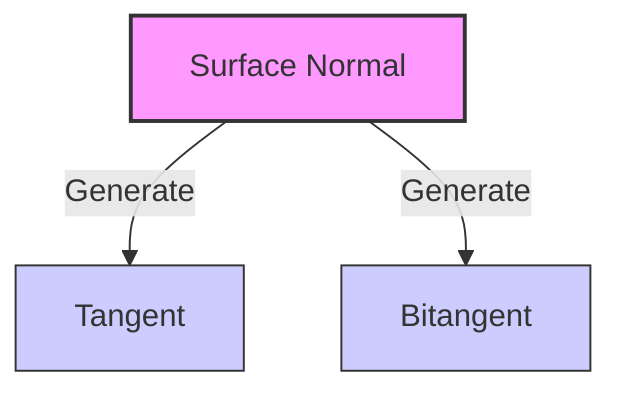

# Perpendicular Vector Generation & Orthogonality

---

[نسخه فارسی این مقاله را اینجا بخوانید](./FA/7-2-Perpendicular-Vector-Generation-Orthogonality-FA.md)


Welcome back to the architectural blueprint. Up until now, we’ve been taking existing vectors and smashing them together with matrices or flattening them with projections. But as an advanced engine architect, you will frequently run into a classic, naked spatial problem: **You have a single vector pointing somewhere in space, and you need to invent a brand new vector that is perfectly perpendicular to it.**

In linear algebra, this is the realm of **Orthogonality**. Two vectors are orthogonal if they meet at a perfect, flawless $90^\circ$ right angle. When they meet at this angle, their spatial alignment completely decouples.

Let's look at how to generate these perpendicular forces on the fly, bypassing the standard textbook jargon to reveal the low-level hardware hacks and structural rules that keep your engine optimized.

---

## 1. The Core Concept: The Zero Alignment Rule

How do we prove mathematically that two vectors are perfectly perpendicular without breaking out a protractor inside the CPU? We check their **Dot Product**.

By definition, the dot product of two vectors measures their directional alignment:


$$\mathbf{a} \cdot \mathbf{b} = \Vert{}\mathbf{a}\Vert{} \Vert{}\mathbf{b}\Vert{} \cos(\theta)$$

When two vectors are exactly perpendicular, the angle $\theta$ between them is $90^\circ$. Because $\cos(90^\circ) = 0$, the entire equation collapses into the ultimate optimization rule of game math:

> **The Orthogonality Covenant:** Two vectors are perfectly perpendicular if and only if their dot product is exactly **0**.

If you need to generate a perpendicular vector, your goal is simply to invent a set of coordinate components that forces this dot product calculation to land squarely on zero.

---

## 2. The Original Problem: Building a Local Coordinate System

Imagine you are building a third-person action game, and the player shoots a grappling hook at a wall. The raycast strikes the wall and hands you a single vector: the **Surface Normal** ($\mathbf{N}$), which points straight out of the wall face.

### The Problem Without Perpendicular Generation

To render a gorgeous, cracked-stone particle impact effect flat against that wall, the GPU needs a full 3D coordinate system anchored at that hit point. It needs three directional axes:



1. **The Normal ($\mathbf{N}$):** Pointing out of the wall (You have this).
2. **The Tangent ($\mathbf{T}$):** Pointing flat across the wall to the right (Missing).
3. **The Bitangent ($\mathbf{B}$):** Pointing flat across the wall upward (Missing).

If you only have the Normal, how do you discover the Tangent and Bitangent vectors out of thin air? Without an automated way to generate perpendicular vectors, your impact effects, bullet holes, and surface decals will render completely broken, floating in space, or misaligned with the geometry of your world.

---

## 3. How It Solves the Problem: The Component-Swapping Hack

To generate a perpendicular vector, we run different algorithms depending on whether we are trapped in flat 2D space or navigating full 3D environments.

### The 2D Secret: The Component Flip

In 2D space, inventing a perpendicular vector is a literal hardware joke. If you have a 2D vector $\mathbf{v} = (x, y)$, you can generate a perfect $90^\circ$ perpendicular vector by swapping the components and negating one of them:

$$\mathbf{v}_{\perp} = (-y, x)$$

```csharp
// 2D Perpendicular Vector
public Vector2 GetPerpendicular2D(Vector2 v) {
    return new Vector2(-v.y, v.x);
}
```

Let's prove it using our Orthogonality Covenant:
$$\mathbf{v} \cdot \mathbf{v}_{\perp} = (x \cdot -y) + (y \cdot x) = -xy + xy = 0$$

### The 3D Secret: The Cross Product and Frisbee Trick

In 3D space, a single vector doesn't just have *one* perpendicular direction—it has an entire infinite disk of perpendicular options spinning around it like a Frisbee.

To lock onto just one stable tangent vector, we use a beautiful fallback algorithm:

1. We check if our vector is pointing mostly upward.
2. If it isn't, we take the cross product of our vector and the global up-axis $(0, 1, 0)$.
3. If it *is* (meaning the cross product would collapse because they are parallel), we switch to a different fallback axis (e.g., $(1, 0, 0)$).

> **⚠️ The God Mode Trap: Cross-Product Collapse**
> If your surface normal is identical to your fallback axis (e.g., normal is $(0,1,0)$ and fallback is $(0,1,0)$), the cross product will return a zero vector $(0,0,0)$. This collapses your entire coordinate system into a singularity. **Always** check for this parallel alignment.

```csharp
// Robust 3D Tangent Generation
public Vector3 GetTangent(Vector3 normal) {
    // Pick a fallback axis that isn't parallel to the normal
    Vector3 fallback = Mathf.Abs(normal.y) < 0.9f ? Vector3.up : Vector3.right;
    
    // Cross product guarantees perpendicularity
    return Vector3.Cross(normal, fallback).normalized;
}
```

---

## 4. The CS Lore: Gram-Schmidt Orthogonalization

When artists import complex 3D meshes into Unity, the vertex data often gets slightly corrupted due to floating-point precision loss or mesh compression algorithms. The Normal, Tangent, and Bitangent vectors stored inside the model's vertices drift away from being perfectly perpendicular.

### The Shader Breakdown Trap

When a lighting shader tries to calculate advanced normal mapping or real-time reflections on a skewed vertex grid, the lighting will look artifact-heavy, blocky, and visually broken.

To fix this on the fly, graphics programmers implement a low-level mathematical cleanup routine directly inside the vertex shader called **Gram-Schmidt Orthogonalization**.

The shader takes the slightly skewed tangent vector ($\mathbf{T}$), projects it onto the normal vector ($\mathbf{N}$) using a scalar projection, and subtracts that projection out. This forcefully strips away the misalignment, snapping the vector field back into a perfect, mathematically pure $90^\circ$ orthogonal grid layout before a single pixel is colored.

```csharp
/// <summary>
/// Forces Orthogonality using Gram-Schmidt. 
/// Vital for cleaning up noisy mesh data before lighting passes.
/// </summary>
public static Vector3 GetOrthogonalizedTangent(Vector3 normal, Vector3 tangent)
{
    // Projection: How much of the tangent aligns with the normal?
    Vector3 projection = Vector3.Dot(tangent, normal) * normal;
    
    // Rejection: Strip the alignment, then re-normalize
    return (tangent - projection).normalized;
}
```

---

## 5. Detailed Gameplay Examples

### Example A: The 2D Top-Down Dodge Dash (Lateral Vector Generation)

You are building a 2D top-down arena shooter. When the player presses the Spacebar while sprinting forward, you want them to instantly execute a high-speed dodge dash directly to their left or right flank to escape incoming enemy fire.

* **The God Mode Method:** You read the player's current velocity vector $\mathbf{v} = (x, y)$. To find the perfect lateral dodge direction without touching slow angular math, you run the component-swapping hack: $\mathbf{d}_{\text{left}} = (-y, x)$. You normalize this vector, multiply it by your dash force scalar, and apply it to the physics body. The player dashes sideways with absolute spatial precision.

```csharp
// Execute a lateral dodge dash
public void PerformDodge(Vector2 currentVelocity, float dashForce)
{
    // 1. Generate perpendicular vector (the "sideways" direction)
    // Using the (-y, x) component swap hack
    Vector2 sideways = new Vector2(-currentVelocity.y, currentVelocity.x).normalized;
    
    // 2. Apply impulse force
    // By multiplying by force, we ensure a sharp, instant directional change
    GetComponent<Rigidbody2D>().AddForce(sideways * dashForce, ForceMode2D.Impulse);
    
    // Note: If you want to dodge RIGHT, just swap to (y, -x)
}
```

### Example B: Procedural Rollercoaster Track Generation (Banking the Rails)

You are building a procedural track generation tool for a racing game or rollercoaster simulator. As the track curves through 3D space, you need to generate the horizontal ties and planks that support the rails, ensuring they always twist and face the direction of the track's path perfectly.

* **The God Mode Method:** At any point along the track's spline curve, you extract the forward velocity tangent vector ($\mathbf{F}$). By evaluating a fallback axis and calculating the cross product $\mathbf{R} = \mathbf{F} \times (0, 1, 0)$, you instantly generate a perfect "Right" vector pointing straight out the side of the track. You then calculate a second cross product $\mathbf{U} = \mathbf{R} \times \mathbf{F}$ to get the clean "Up" vector. You have procedurally engineered a custom, stable 3D coordinate system at that exact point on the track.

```csharp
// Generate stable 3D coordinate system for track geometry
public void GenerateTrackSection(Vector3 forwardTangent, Vector3 position)
{
    // 1. Generate Right vector (perpendicular to forward and global Up)
    // We use a robust cross product to ensure a stable bank
    Vector3 right = Vector3.Cross(forwardTangent, Vector3.up).normalized;
    
    // 2. Generate Up vector (perpendicular to Right and Forward)
    // This completes the local orthogonal basis for the track segment
    Vector3 up = Vector3.Cross(right, forwardTangent).normalized;
    
    // 3. Orient the rail mesh
    // 'right' defines the track width, 'up' defines the banking angle
    DrawRailSection(position, right, up);
}
```

---

## 6. The Unity Code: Infinite Tangent Generation

Here is a highly optimized Unity C# script demonstrating how to generate stable, perpendicular 3D tangent spaces out of a single raw vector direction using pure math.

```csharp
using UnityEngine;

public class OrthogonalityArchitect : MonoBehaviour
{
    void Update()
    {
        // Simulate a raycast hit normal pointing out from an irregular surface
        Vector3 surfaceNormal = new Vector3(0.5f, 0.8f, 0.1f).normalized;
        
        // Visualize the raw incoming surface normal vector (Blue)
        Debug.DrawRay(transform.position, surfaceNormal * 2f, Color.blue);

        // ====================================================
        // 1. GENERATE THE PERPENDICULAR TANGENT VECTOR (3D)
        // We select a fallback axis based on alignment to avoid cross-product collapse
        // ====================================================
        Vector3 fallbackAxis = Mathf.Abs(surfaceNormal.y) < 0.9f ? new Vector3(0f, 1f, 0f) : new Vector3(1f, 0f, 0f);
        
        // The Cross Product guarantees a vector perfectly perpendicular to both inputs
        Vector3 perpendicularTangent = Vector3.Cross(surfaceNormal, fallbackAxis).normalized;

        // Visualize our freshly invented perpendicular tangent vector (Red)
        Debug.DrawRay(transform.position, perpendicularTangent * 2f, Color.red);

        // ====================================================
        // 2. GENERATE THE THIRD AXIS (The Bitangent)
        // Cross product the normal and tangent to complete the 3D grid space
        // ====================================================
        Vector3 bitangent = Vector3.Cross(surfaceNormal, perpendicularTangent).normalized;

        // Visualize the final coordinating axis vector (Green)
        Debug.DrawRay(transform.position, bitangent * 2f, Color.green);

        // ====================================================
        // 3. THE 2D SIDE HACK (For Flat Vector Generation)
        // If we only care about a flat 2D top-down horizontal plane (X and Z)
        // ====================================================
        Vector2 flatVelocity = new Vector2(surfaceNormal.x, surfaceNormal.z);
        
        // Flawless component swap: (-y, x)
        Vector2 flatPerpendicular = new Vector2(-flatVelocity.y, flatVelocity.x);
    }
}

```

---

### [Surface Normal Analysis Area Interpretation](./7-3-Surface-Normal-Analysis-Area-Interpretation.md)
