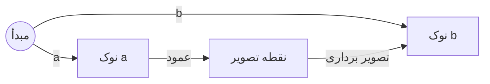

# تصویرهای اسکالر و برداری (سایه‌افکن‌ها)
---

[Read English version of this article](../7-1-Scalar-Vector-Projections.md)

به طرح معماری خوش آمدید. تا اینجا، در حال ساخت فضاها، چرخاندن آن‌ها و ترکیبشان با ماتریس‌ها بوده‌ایم. حالا زمان آن است که بر یکی از پرکاربردترین ابزارهای بازجویی فضایی در توسعه بازی تمرکز کنیم: **تصویرها (Projections)**.

در دنیای واقعی، وقتی چراغ‌قوه‌ای را روی یک شیء می‌تابانید، سایه‌ای تخت روی دیوار پشت آن می‌افتد. در ریاضیات بازی، **تصویر** دقیقاً همان فرآیند است که با بردارها محاسبه می‌شود. شما یک بردار را که در فضای ۳ بعدی پرواز می‌کند می‌گیرید، یک چراغ‌قوه مجازی بالای آن قرار می‌دهید و آن را روی یک خط جهت‌دار دیگر پهن می‌کنید.

دو جنبه از این مفهوم وجود دارد که باید بر آن‌ها مسلط شوید: **تصویرهای اسکالر** (طول آن سایه) و **تصویرهای برداری** (خودِ بردار سایه جهت‌دار). بیایید آن‌ها را تحلیل کنیم.

---

## ۱. مفهوم اصلی: انداختن سایه‌های عمود

برای درک تصویرها بدون غرق شدن در اثبات‌های جبری، آن را به عنوان یک ابزار فشرده‌سازی فضایی در نظر بگیرید.

فرض کنید دو بردار دارید که از یک نقطه مبدأ شروع می‌شوند:



* بردار $\mathbf{b}$: یک جهت مبنا که روی زمین کشیده شده است (مثل باند فرودگاه).
* بردار $\mathbf{a}$: یک بردار هدف که به سمت هوا اشاره می‌کند (مثل هواپیمایی که در حال پرواز است).

اگر یک خط کاملاً مستقیم از نوک بردار $\mathbf{a}$ دقیقاً به سمت پایین روی بردار $\mathbf{b}$ با زاویه قائمه $90^\circ$ بیندازید، یک مثلث قائم‌الزاویه ایجاد می‌کنید.

* **تصویر اسکالر (اندازه):** این یک عدد اسکالر ممیز شناور واحد است. این عدد طول دقیق سایه‌ای را که بردار $\mathbf{a}$ روی جهت مبنای $\mathbf{b}$ می‌اندازد، اندازه‌گیری می‌کند. پاسخ این سوال است: *"بردار $\mathbf{a}$ واقعاً چقدر در جهت $\mathbf{b}$ پیش می‌رود؟"*
* **تصویر برداری (پیکان):** این طول اسکالر را می‌گیرد و دوباره به یک بردار ۳ بعدی کامل که دقیقاً در جهت $\mathbf{b}$ است تبدیل می‌کند. این پیکان فیزیکی است که نمایانگر خودِ سایه است.

---

## ۲. موتور ریاضی: مسلح شدن به ضرب داخلی (Dot Product)

برای محاسبه این تصویرها در سطح سیلیکون، ما از ابزارهای خط‌کش هندسی کند استفاده نمی‌کنیم. ما از **ضرب داخلی** ($\mathbf{a} \cdot \mathbf{b}$) که فوق‌العاده سریع است استفاده می‌کنیم.

### الف. فرمول تصویر اسکالر

برای یافتن طول سایه، ضرب داخلی بردار $\mathbf{a}$ را گرفته و در **جهت نرمال‌شده** بردار $\mathbf{b}$ (که با $\hat{\mathbf{b}}$ نوشته می‌شود) ضرب می‌کنیم:

$$\text{scalar\_proj} = \mathbf{a} \cdot \hat{\mathbf{b}} = \frac{\mathbf{a} \cdot \mathbf{b}}{\Vert{}\mathbf{b}\Vert{}}$$

اگر $\mathbf{b}$ از قبل یک بردار واحد نرمال‌شده (با طول ۱) باشد، ریاضیات به یک میانبر بهینه‌سازی نهایی فرو می‌پاشد: تصویر اسکالر *فقط* همان ضرب داخلی خام $\mathbf{a} \cdot \mathbf{b}$ است!

### ب. فرمول تصویر برداری

برای به دست آوردن بردار سایه واقعی، آن طول اسکالری را که پیدا کردیم می‌گیریم و دوباره در بردار جهت نرمال‌شده $\hat{\mathbf{b}}$ ضرب می‌کنیم:

$$\text{proj}_{\mathbf{b}}(\mathbf{a}) = (\mathbf{a} \cdot \hat{\mathbf{b}}) \hat{\mathbf{b}} = \frac{\mathbf{a} \cdot \mathbf{b}}{\Vert{}\mathbf{b}\Vert{}^2} \mathbf{b}$$

### ⚠️ هشدار حالت خدایی: خطرات بردار صفر
در موتورهای فیزیک تولیدی، $\mathbf{b}$ گاهی اوقات می‌تواند یک بردار صفر باشد (مثلاً یک نرمال برخورد تحلیل‌رفته). تقسیم بر اندازه آن منجر به `NaN` (Not a Number) می‌شود که بی‌صدا در محاسبات تغییر شکل شما پخش شده و وضعیت بازی شما را خراب می‌کند.

همیشه ورودی‌های خود را برای پایداری موتور sanitize کنید:

```csharp
// تصویرسازی مقاوم
float lengthSq = Vector3.Dot(b, b);
if (lengthSq > float.Epsilon)
{
    Vector3 projection = (Vector3.Dot(a, b) / lengthSq) * b;
    // ...
}
else
{
    // به عنوان بردار صفر یا پیش‌فرض مدیریت کنید
}
```

### ۲.۳ مثال‌های کاربردی

#### مثال عددی هم‌راستایی
دو بردار را تصور کنید: $\mathbf{a} = (3, 4)$ و $\mathbf{b} = (5, 0)$.
ضرب داخلی آن‌ها برابر است با:
$$\mathbf{a} \cdot \mathbf{b} = (3 \times 5) + (4 \times 0) = 15$$
از آنجایی که نتیجه یک عدد مثبت بزرگ است، می‌دانیم که این بردارها بسیار هم‌راستا هستند و در جهت کلی یکسانی اشاره می‌کنند. اگر $\mathbf{c} = (-5, 0)$ داشتیم، ضرب داخلی $\mathbf{a} \cdot \mathbf{c} = (3 \times -5) + (4 \times 0) = -15$ می‌شد که نشان‌دهنده جهت مخالف آن‌هاست.

#### کاربرد برنامه‌نویسی: بررسی میدان دید (FOV)
این روشی است که شما می‌توانید بدون محاسبات گران قیمت `Mathf.Acos` (مثلثات معکوس)، فوراً تشخیص دهید که آیا یک دشمن در مقابل بازیکن قرار دارد یا خیر:

```csharp
public bool IsTargetInFOV(Transform player, Transform target, float fieldOfViewDegrees)
{
    Vector3 toTarget = (target.position - player.position).normalized;
    // ضرب داخلی بین بردار رو به جلو و بردار به سمت هدف
    float dot = Vector3.Dot(player.forward, toTarget);

    // کسینوس زاویه: dot > cos(FOV / 2)
    // این کار به طور قابل توجهی سریع‌تر از محاسبه زاویه واقعی است!
    return dot > Mathf.Cos(fieldOfViewDegrees * 0.5f * Mathf.Deg2Rad);
}
```

---

## ۳. مشکل اصلی: لغزش در امتداد دیوارهای نامنظم

تصور کنید در حال ساخت یک سیستم فیزیکی برای یک کنترلر کاراکتر هستید و بازیکن به صورت مورب مستقیماً به یک دیوار بتنی جامد برخورد می‌کند.

### رویکرد شکست‌خورده بدون تصویرها

اگر لحظه‌ای که بازیکن به دیوار برخورد می‌کند، تمام حرکت را متوقف کنید، بازی بسیار چسبنده، کند و خراب به نظر می‌رسد. بازیکن هر زمان که با یک سطح تماس پیدا کند، در جای خود منجمد می‌شود.

### راه حل تصویر (بردار لغزش)

برای اینکه حرکت بسیار نرم و روان احساس شود، می‌خواهید بازیکن به شکلی روان در امتداد دیوار **بلغزد** و تکانه رو به جلوی خود را به حرکت جانبی موازی با سطح تبدیل کند.

با استفاده از تصویر برداری، بردار سرعت ورودی بازیکن را روی صفحه سطح دیوار تصویر می‌کنید. این کار مقدار دقیق سرعتِ در حال فشار به *داخل* دیوار (که آن را حذف می‌کنید) و مقدار دقیق سرعتِ در حال حرکت *موازی* با دیوار (که آن را حفظ می‌کنید) را جدا می‌کند. این تجزیه ریاضی **Vector Rejection** نامیده می‌شود و روشی است که هر موتور بازی بزرگ برای لغزش تمیز در هنگام برخورد از آن استفاده می‌کند.

---

## ۴. دانش علوم کامپیوتر: تجزیه نیروها در شیدرها

در برنامه‌نویسی گرافیکی GPU مدرن، تصویرهای اسکالر و برداری میلیون‌ها بار در هر فریم داخل **شیدرهای رأس و قطعه** برای محاسبه نورپردازی پیشرفته و دستکاری رأس استفاده می‌شوند.

### نورپردازی مبتنی بر فیزیک (PBR)

وقتی یک پرتو نور به یک سطح ناهموار برخورد می‌کند، شیدر باید آن بردار نور ورودی را به دو مؤلفه ساختاری متمایز تقسیم کند:

۱. **مؤلفه آینه‌ای (Specular):** نوری که به طور تمیز از سطح به چشمان شما بازتاب می‌شود.
۲. **مؤلفه انتشاری (Diffuse):** نوری که به سطح نفوذ کرده و پراکنده می‌شود.

شیدرهای مدرن از ضرب داخلی سخت‌افزاری برای تصویر کردن سریع جهت نور نسبت به بردار نرمال سطح استفاده می‌کنند. از آنجایی که GPUها دستورالعمل‌های تک-چرخه‌ای برای ضرب داخلی دارند، این تقسیم‌بندی تصویر هزینه‌ی عملکردی تقریباً صفر دارد و به بازی‌ها اجازه می‌دهد نورپردازی مواد پیچیده را به صورت لحظه‌ای محاسبه کنند.

---

## ۵. مثال‌های دقیق گیم‌پلی

### مثال الف: چک‌پوینت بازی مسابقه‌ای (پیشرفت در مسیر)

شما در حال ساخت یک بازی مسابقه‌ای هستید و باید دقیقاً بدانید یک ماشین چقدر در مسیر پیشرفت کرده است تا تابلوی امتیازات را به‌روز کنید، حتی اگر راننده در حال ویراژ دادن به چپ و راست جاده باشد.

* **روش حالت خدایی:** یک بردار مبنا ($\mathbf{b}$) در امتداد دقیق خط مرکزی مسیر ایجاد می‌کنید. بردار جابجایی ماشین ($\mathbf{a}$) را از شروع بخش مسیر می‌گیرید. با اجرای یک **تصویر اسکالر** از ماشین روی خط مسیر، یک عدد تکی تمیز استخراج می‌کنید که دقیقاً نشان می‌دهد ماشین چند متر در مسیر پیشرفت کرده است، در حالی که ویراژهای جانبی کاملاً نادیده گرفته می‌شوند.

```csharp
// محاسبه پیشرفت در امتداد بخش مسیر
Vector3 trackDirection = (segmentEnd.position - segmentStart.position).normalized;
Vector3 carDisplacement = car.position - segmentStart.position;

// تصویر اسکالر: ضرب داخلی اندازه 'carDisplacement' در امتداد 'trackDirection' را می‌دهد
float progressAlongTrack = Vector3.Dot(carDisplacement, trackDirection);

// حتی اگر ماشین ۱۰ واحد به کناره‌ها منحرف شده باشد، 'progressAlongTrack' فقط به 
// فاصله نسبت به جهت رو به جلوی مسیر اهمیت می‌دهد.
```

### مثال ب: هم‌ترازی گرانش روی سیارات کروی

شما در حال ساخت یک بازی اکتشاف فضایی با سیارات کروی کوچک هستید. وقتی بازیکن می‌پرد، گرانش باید آن‌ها را مستقیماً به سمت مرکز سیاره بکشد.

* **روش حالت خدایی:** بردار جابجایی از هسته سیاره به بازیکن را محاسبه می‌کنید. آن محور پایین سفارشی شما می‌شود. برای اینکه بازیکن به طور طبیعی حرکت کند، بردار حرکت کیبورد خام آن‌ها را بر صفحه مماس کره با استفاده از تصویر برداری نگاشت می‌کنید.

```csharp
// ۱. محاسبه جهت گرانش (از مرکز به سمت بازیکن)
Vector3 gravityDown = (player.position - planetCore.position).normalized;

// ۲. ما حرکتی عمود بر gravityDown (روی صفحه مماس) می‌خواهیم
// Vector Rejection: حرکت - (تصویر روی gravityDown)
Vector3 rawInput = transform.right * input.x + transform.forward * input.z;

// جداسازی حرکت موازی با گرانش
Vector3 movementIntoGravity = Vector3.Project(rawInput, gravityDown);

// تفریق آن برای به دست آوردن حرکت روی صفحه مماس
Vector3 alignedMovement = rawInput - movementIntoGravity;

// 'alignedMovement' اکنون تضمین شده است که عمود بر نرمال سطح باشد،
// که از حرکت ناخواسته بازیکن به "داخل" یا "دور" از سیاره جلوگیری می‌کند.
```

---

## ۶. کد یونیتی: لغزش نرم بردار و جداسازی مؤلفه‌ها

کتابخانه `Vector3` یونیتی در واقع شامل توابع تصویرسازی داخلی است که این ریاضیات را به شکلی تمیز مدیریت می‌کند. در اینجا نحوه استفاده از آن‌ها برای ساخت یک خط لوله لغزش برخورد دستی آورده شده است.

```csharp
using UnityEngine;

public class ProjectionArchitect : MonoBehaviour
{
    [Header("پیکربندی حرکت")]
    [SerializeField] private Vector3 rawInputVelocity = new Vector3(3f, 0f, 4f);

    void Update()
    {
        // شبیه‌سازی بردار نرمال سطح دیوار (اشاره مستقیم به بیرون از دیوار)
        Vector3 wallNormal = new Vector3(-1f, 0f, 0f).normalized; 
        
        // تجسم مسیر سرعت مد نظر خام (زرد)
        Debug.DrawRay(transform.position, rawInputVelocity, Color.yellow);

        // ====================================================
        // ۱. جداسازی بردار نفوذ (تصویر برداری)
        // پیدا کردن دقیق مقدار نیرو که مستقیماً به داخل نرمال دیوار فشار می‌آورد
        // ====================================================
        Vector3 penetrationVector = Vector3.Project(rawInputVelocity, wallNormal);
        
        // تجسم بردار نیروی مخرب (قرمز)
        Debug.DrawRay(transform.position, penetrationVector, Color.red);

        // ====================================================
        // ۲. محاسبه بردار لغزش (Vector Rejection)
        // تفریق نیروی نفوذ از سرعت خام برای به دست آوردن مسیر موازی
        // ====================================================
        Vector3 perfectSlidingVelocity = rawInputVelocity - penetrationVector;

        // تجسم بردار سرعت لغزش تمیز و بهینه (سبز)
        Debug.DrawRay(transform.position, perfectSlidingVelocity, Color.green);

        // ====================================================
        // ۳. ردیابی پیشرفت مسیر (تصویر اسکالر)
        // یافتن فاصله مطلق اسکالر لغزش ما در امتداد یک جهت سفارشی
        // ====================================================
        Vector3 forwardTrackDirection = new Vector3(0f, 0f, 1f);
        
        // میانبر ضرب داخلی: اگر جهت نرمال شده باشد، Vector3.Dot طول تصویر اسکالر را برمی‌گرداند!
        float advanceDistance = Vector3.Dot(perfectSlidingVelocity, forwardTrackDirection);
    }
}
```

---

### [بعدی: تولید بردارهای عمود بر هم و تعامد](./7-2-Perpendicular-Vector-Generation-Orthogonality-FA.md)
