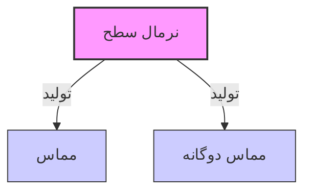

# تولید بردار عمود و تعامد (Orthogonality)

---

[Read English version of this article](../7-2-Perpendicular-Vector-Generation-Orthogonality.md)

به طرح معماری خوش آمدید. تا اینجا، ما بردار‌های موجود را با ماتریس‌ها ترکیب کرده‌ایم یا با تصویرها (Projections) آن‌ها را تخت کرده‌ایم. اما به عنوان یک معمار پیشرفته موتور بازی، مکرراً با یک مشکل فضایی کلاسیک و عریان روبرو خواهید شد: **شما یک بردار دارید که در جایی از فضا قرار دارد و نیاز دارید یک بردار کاملاً جدید ایجاد کنید که دقیقاً بر آن عمود باشد.**

در جبر خطی، این قلمرو **تعامد (Orthogonality)** است. دو بردار متعامد هستند اگر در یک زاویه کامل و بی‌نقص $90^\circ$ با هم برخورد کنند. وقتی آن‌ها در این زاویه برخورد می‌کنند، هم‌ترازی فضایی آن‌ها کاملاً از هم جدا (decoupled) می‌شود.

بیایید نگاهی بیندازیم به اینکه چگونه این نیروهای عمود را در لحظه ایجاد کنیم، با دور زدن اصطلاحات پیچیده کتاب‌های درسی برای آشکار کردن هک‌های سخت‌افزاری سطح پایین و قوانین ساختاری که موتور شما را بهینه نگه می‌دارند.

---

## ۱. مفهوم اصلی: قانون هم‌ترازی صفر

چگونه از نظر ریاضی ثابت کنیم که دو بردار کاملاً عمود هستند بدون اینکه نیاز باشد داخل CPU گونیا قرار دهیم؟ ما **ضرب داخلی (Dot Product)** آن‌ها را بررسی می‌کنیم.

طبق تعریف، ضرب داخلی دو بردار، هم‌ترازی جهت آن‌ها را اندازه‌گیری می‌کند:

$$\mathbf{a} \cdot \mathbf{b} = \Vert{}\mathbf{a}\Vert{} \Vert{}\mathbf{b}\Vert{} \cos(\theta)$$

وقتی دو بردار دقیقاً عمود باشند، زاویه $\theta$ بین آن‌ها $90^\circ$ است. از آنجایی که $\cos(90^\circ) = 0$ است، کل معادله به قانون بهینه‌سازی نهایی ریاضیات بازی فرو می‌پاشد:

> **پیمان تعامد:** دو بردار کاملاً عمود هستند اگر و تنها اگر ضرب داخلی آن‌ها دقیقاً **۰** باشد.

اگر نیاز به تولید یک بردار عمود دارید، هدف شما صرفاً ابداع مجموعه‌ای از مؤلفه‌های مختصاتی است که این محاسبه ضرب داخلی را دقیقاً به صفر برساند.

---

## ۲. مشکل اصلی: ساخت یک سیستم مختصات محلی

تصور کنید در حال ساخت یک بازی اکشن سوم شخص هستید و بازیکن یک قلاب (grappling hook) به سمت دیوار پرتاب می‌کند. ری‌کست (Raycast) به دیوار برخورد می‌کند و یک بردار به شما می‌دهد: **نرمال سطح** ($\mathbf{N}$)، که مستقیماً از سطح دیوار به بیرون اشاره می‌کند.

### مشکل بدون تولید بردار عمود

برای رندر کردن یک افکت ذرات برخورد زیبا و مسطح روی دیوار، GPU به یک سیستم مختصات کامل ۳ بعدی نیاز دارد که در آن نقطه برخورد لنگر شده باشد. به سه محور جهت‌دار نیاز دارد:



۱. **نرمال ($\mathbf{N}$):** اشاره به بیرون از دیوار (این را دارید).
۲. **مماس ($\mathbf{T}$):** اشاره به صورت تخت در امتداد دیوار به سمت راست (گم شده است).
۳. **مماس دوگانه ($\mathbf{B}$):** اشاره به صورت تخت در امتداد دیوار به سمت بالا (گم شده است).

اگر فقط نرمال را دارید، چگونه محورهای مماس و مماس دوگانه را از هیچ خلق می‌کنید؟ بدون روشی خودکار برای تولید بردار‌های عمود، افکت‌های برخورد، جای گلوله و دکال‌های سطح شما کاملاً خراب رندر می‌شوند، در فضا شناور خواهند بود یا با هندسه دنیای شما هم‌تراز نخواهند بود.

---

## ۳. نحوه حل مشکل: هکِ جابجایی مؤلفه‌ها

برای تولید یک بردار عمود، بسته به اینکه در فضای تخت ۲ بعدی محصور باشیم یا در محیط‌های ۳ بعدی کامل حرکت کنیم، الگوریتم‌های متفاوتی را اجرا می‌کنیم.

### راز ۲ بعدی: فلیپ کردن مؤلفه‌ها

در فضای ۲ بعدی، ابداع یک بردار عمود یک شوخی سخت‌افزاری است. اگر یک بردار ۲ بعدی $\mathbf{v} = (x, y)$ دارید، می‌توانید یک بردار عمود $90^\circ$ کامل با جابجایی مؤلفه‌ها و منفی کردن یکی از آن‌ها ایجاد کنید:

$$\mathbf{v}_{\perp} = (-y, x)$$

```csharp
// بردار عمود ۲ بعدی
public Vector2 GetPerpendicular2D(Vector2 v) {
    return new Vector2(-v.y, v.x);
}
```

بیایید آن را با استفاده از پیمان تعامد اثبات کنیم:
$$\mathbf{v} \cdot \mathbf{v}_{\perp} = (x \cdot -y) + (y \cdot x) = -xy + xy = 0$$

### راز ۳ بعدی: ضرب خارجی (Cross Product) و ترفند فریزبی

در فضای ۳ بعدی، یک بردار منفرد فقط *یک* جهت عمود ندارد—بلکه یک دیسک بی‌نهایت از گزینه‌های عمود دارد که مانند فریزبی دور آن می‌چرخند.

برای قفل کردن روی تنها یک بردار مماس پایدار، از یک الگوریتم بازگشتی زیبا استفاده می‌کنیم:

۱. بررسی می‌کنیم که آیا بردار ما عمدتاً رو به بالاست.
۲. اگر نیست، ضرب خارجی بردار خود را با محور بالای جهانی $(0, 1, 0)$ می‌گیریم.
۳. اگر *هست* (به این معنی که ضرب خارجی به دلیل موازی بودن فرو می‌پاشد)، به یک محور جایگزین دیگر (مثلاً $(1, 0, 0)$) سوئیچ می‌کنیم.

> **⚠️ تله حالت خدایی: فروپاشی ضرب خارجی**
> اگر نرمال سطح شما با محور جایگزین شما یکسان باشد (مثلاً نرمال $(0,1,0)$ و جایگزین $(0,1,0)$ باشد)، ضرب خارجی یک بردار صفر $(0,0,0)$ برمی‌گرداند. این کل سیستم مختصات شما را به یک تکینگی فرو می‌برد. **همیشه** این هم‌ترازی موازی را بررسی کنید.

```csharp
// تولید مماس ۳ بعدی مقاوم
public Vector3 GetTangent(Vector3 normal) {
    // انتخاب یک محور جایگزین که با نرمال موازی نباشد
    Vector3 fallback = Mathf.Abs(normal.y) < 0.9f ? Vector3.up : Vector3.right;
    
    // ضرب خارجی تعامد را تضمین می‌کند
    return Vector3.Cross(normal, fallback).normalized;
}
```

---

## ۴. دانش علوم کامپیوتر: تعامد گرام-اشمیت (Gram-Schmidt)

وقتی هنرمندان مدل‌های ۳ بعدی پیچیده را وارد یونیتی می‌کنند، داده‌های رأس (Vertex Data) اغلب به دلیل از دست رفتن دقت ممیز شناور یا الگوریتم‌های فشرده‌سازی مش، کمی خراب می‌شوند. بردارهای نرمال، مماس و مماس دوگانه ذخیره شده در رأس‌های مدل از کاملاً عمود بودن فاصله می‌گیرند.

### تله تجزیه شیدر

وقتی یک شیدر نورپردازی سعی می‌کند نرمال‌مپینگ پیشرفته یا بازتاب‌های لحظه‌ای را روی یک شبکه رأس کج محاسبه کند، نورپردازی به صورت آرتیفکت‌دار، بلوکی و خراب دیده می‌شود.

برای رفع این مشکل در لحظه، برنامه‌نویسان گرافیک یک روتین پاک‌سازی ریاضی سطح پایین مستقیماً داخل شیدر رأس به نام **تعامد گرام-اشمیت** پیاده‌سازی می‌کنند.

شیدر بردار مماس کمی کج شده ($\mathbf{T}$) را می‌گیرد، آن را با استفاده از یک تصویر اسکالر روی بردار نرمال ($\mathbf{N}$) تصویر می‌کند و آن تصویر را تفریق می‌کند. این کار به زور عدم هم‌ترازی را از بین می‌برد و فیلد بردار را قبل از رنگ‌آمیزی حتی یک پیکسل، به یک شبکه متعامد ۹۰ درجه کامل و خالص ریاضی بازمی‌گرداند.

```csharp
/// <summary>
/// تعامد را با استفاده از گرام-اشمیت اعمال می‌کند.
/// برای پاک‌سازی داده‌های مش نویزی قبل از پاس‌های نورپردازی حیاتی است.
/// </summary>
public static Vector3 GetOrthogonalizedTangent(Vector3 normal, Vector3 tangent)
{
    // تصویر: چه مقدار از مماس با نرمال هم‌تراست؟
    Vector3 projection = Vector3.Dot(tangent, normal) * normal;
    
    // تفریق: حذف هم‌ترازی، سپس نرمال‌سازی مجدد
    return (tangent - projection).normalized;
}
```

---

## ۵. مثال‌های دقیق گیم‌پلی

### مثال الف: دژ دش ۲ بعدی بالا به پایین (تولید بردار جانبی)

شما در حال ساخت یک تیرانداز آرنای ۲ بعدی از بالا به پایین هستید. وقتی بازیکن هنگام دویدن رو به جلو کلید Space را فشار می‌دهد، می‌خواهید فوراً یک دژ دش (dodge dash) با سرعت بالا مستقیماً به سمت پهلوی چپ یا راست آن‌ها برای فرار از آتش دشمن اجرا کنید.

* **روش حالت خدایی:** بردار سرعت فعلی بازیکن $\mathbf{v} = (x, y)$ را می‌خوانید. برای یافتن جهت دش جانبی کامل بدون لمس ریاضیات زاویه‌ای کند، هک جابجایی مؤلفه‌ها را اجرا می‌کنید: $\mathbf{d}_{\text{left}} = (-y, x)$.

```csharp
// اجرای یک دژ دش جانبی
public void PerformDodge(Vector2 currentVelocity, float dashForce)
{
    // ۱. تولید بردار عمود (جهت "پهلویی")
    // با استفاده از هک جابجایی مؤلفه‌های (-y, x)
    Vector2 sideways = new Vector2(-currentVelocity.y, currentVelocity.x).normalized;
    
    // ۲. اعمال نیروی ضربه
    // با ضرب در نیرو، تغییر جهت شارپ و فوری را تضمین می‌کنیم
    GetComponent<Rigidbody2D>().AddForce(sideways * dashForce, ForceMode2D.Impulse);
    
    // نکته: اگر می‌خواهید به راست دش کنید، فقط به (y, -x) جابجا کنید
}
```

### مثال ب: تولید رویه مسیر ترن هوایی (بانک کردن ریل‌ها)

شما در حال ساخت یک ابزار تولید رویه (Procedural) مسیر هستید. همانطور که مسیر در فضای ۳ بعدی می‌پیچد، باید اتصالات افقی و تخته‌هایی که ریل‌ها را نگه می‌دارند ایجاد کنید، و مطمئن شوید که همیشه می‌پیچند و دقیقاً رو به جهت مسیر قرار می‌گیرند.

* **روش حالت خدایی:** در هر نقطه در امتداد اسپلاین مسیر، بردار مماس رو به جلو ($\mathbf{F}$) را استخراج می‌کنید. با محاسبه ضرب خارجی $\mathbf{R} = \mathbf{F} \times (0, 1, 0)$، فوراً یک بردار "راست" کامل ایجاد می‌کنید که مستقیماً از سمت مسیر به بیرون اشاره می‌کند.

```csharp
// تولید سیستم مختصات ۳ بعدی پایدار برای هندسه مسیر
public void GenerateTrackSection(Vector3 forwardTangent, Vector3 position)
{
    // ۱. تولید بردار راست (عمود بر رو به جلو و بالای جهانی)
    // از یک ضرب خارجی مقاوم استفاده می‌کنیم تا یک بانک پایدار را تضمین کنیم
    Vector3 right = Vector3.Cross(forwardTangent, Vector3.up).normalized;
    
    // ۲. تولید بردار بالا (عمود بر راست و رو به جلو)
    // این پایه متعامد محلی برای بخش مسیر را کامل می‌کند
    Vector3 up = Vector3.Cross(right, forwardTangent).normalized;
    
    // ۳. جهت‌دهی مش ریل
    // 'right' عرض مسیر و 'up' زاویه بانکینگ را تعریف می‌کند
    DrawRailSection(position, right, up);
}
```

---

## ۶. کد یونیتی: تولید مماس بی‌نهایت

در اینجا یک اسکریپت C# یونیتی بسیار بهینه شده آورده شده است که نشان می‌دهد چگونه می‌توان فضاهای مماس ۳ بعدی پایدار و عمود را از یک جهت بردار خام با استفاده از ریاضیات خالص ایجاد کرد.

```csharp
using UnityEngine;

public class OrthogonalityArchitect : MonoBehaviour
{
    void Update()
    {
        // شبیه‌سازی یک نرمال برخورد ری‌کست که از یک سطح نامنظم به بیرون اشاره می‌کند
        Vector3 surfaceNormal = new Vector3(0.5f, 0.8f, 0.1f).normalized;
        
        // تجسم بردار نرمال سطح ورودی خام (آبی)
        Debug.DrawRay(transform.position, surfaceNormal * 2f, Color.blue);

        // ====================================================
        // ۱. تولید بردار مماس عمود (۳ بعدی)
        // ما یک محور جایگزین بر اساس هم‌ترازی انتخاب می‌کنیم تا از فروپاشی ضرب خارجی جلوگیری کنیم
        // ====================================================
        Vector3 fallbackAxis = Mathf.Abs(surfaceNormal.y) < 0.9f ? new Vector3(0f, 1f, 0f) : new Vector3(1f, 0f, 0f);
        
        // ضرب خارجی برداری را تضمین می‌کند که کاملاً بر هر دو ورودی عمود است
        Vector3 perpendicularTangent = Vector3.Cross(surfaceNormal, fallbackAxis).normalized;

        // تجسم بردار مماس عمود تازه ابداع شده ما (قرمز)
        Debug.DrawRay(transform.position, perpendicularTangent * 2f, Color.red);

        // ====================================================
        // ۲. تولید محور سوم (مماس دوگانه)
        // ضرب خارجی نرمال و مماس برای کامل کردن فضای شبکه ۳ بعدی
        // ====================================================
        Vector3 bitangent = Vector3.Cross(surfaceNormal, perpendicularTangent).normalized;

        // تجسم بردار محور مختصات نهایی (سبز)
        Debug.DrawRay(transform.position, bitangent * 2f, Color.green);

        // ====================================================
        // ۳. هک سمت ۲ بعدی (برای تولید بردار تخت)
        // اگر فقط به یک صفحه افقی ۲ بعدی بالا به پایین اهمیت می‌دهیم (X و Z)
        // ====================================================
        Vector2 flatVelocity = new Vector2(surfaceNormal.x, surfaceNormal.z);
        
        // تعویض مؤلفه بی‌نقص: (-y, x)
        Vector2 flatPerpendicular = new Vector2(-flatVelocity.y, flatVelocity.x);
    }
}
```

---

### [بعدی: تفسیر مساحت تحلیل نرمال سطح](./7-3-Surface-Normal-Analysis-Area-Interpretation-FA.md)
